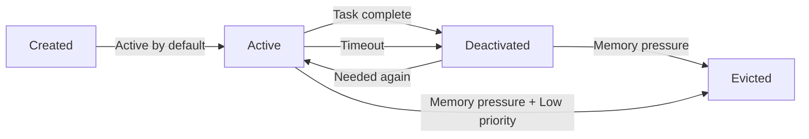

# Memory System Concepts

## Overview

The Agent Zoo memory system provides a flexible, multi-tiered architecture for managing agent memory. This document explains the key concepts and design decisions.

## Key Concepts

### 1. The `is_active` Field

The `is_active` field tracks whether a memory item is currently relevant to ongoing tasks:

- **Active State (default)**: When memories are created, they start as active
- **Deactivation**: Memories become inactive when:
  - They're no longer needed for the current task
  - They exceed the inactivity threshold (auto-deactivation)
  - They're explicitly marked inactive by the agent
- **Reactivation**: Inactive memories can become active again if they become relevant
- **Eviction Priority**: Inactive memories are prioritized for eviction when space is needed

#### Why Not Just Delete?

Instead of deleting memories immediately, we mark them inactive because:
1. They might become relevant again (e.g., user returns to a previous topic)
2. They provide context history that might be useful
3. They can be evicted automatically when memory pressure occurs
4. Reactivation is cheaper than recreation

### 2. Token Counting

Token counting is essential for managing context windows effectively:

- **Automatic Estimation**: If not provided, tokens are estimated from content length
- **Per-Item Tracking**: Each memory item tracks its token usage
- **Global Budget**: Total tokens across all memories are tracked
- **Query Budgets**: Retrieval can be limited by token count

#### Implementation Note

Currently using character-based estimation (1 token ≈ 4 characters). In production, you should use:
- `tiktoken` for OpenAI models
- Model-specific tokenizers for other LLMs
- Cached token counts for efficiency

### 3. Sliding Window Pattern

The "sliding window" is not a fixed window but a dynamic context management approach:

```
Time →
[Old Task] → [Deactivated]
    [Current Context] → [Active, High Priority]
        [Recent Info] → [Active, Medium Priority]
            [Background] → [Active/Inactive, Low Priority]
```

#### How It Works

1. **No Fixed Boundaries**: Unlike traditional sliding windows, there's no fixed start/end
2. **Priority-Based**: Items stay based on importance, not just recency
3. **Token-Aware**: Window "size" is determined by token budget
4. **Dynamic Adjustment**: Automatically adjusts as tasks change

### 4. Eviction Strategies

When memory is full, items must be evicted. Available strategies:

- **LRU (Least Recently Used)**: Evicts items not accessed recently
- **LFU (Least Frequently Used)**: Evicts items accessed least often
- **FIFO (First In First Out)**: Evicts oldest items first
- **Priority**: Evicts based on importance scores
- **Hybrid (default)**: Combines multiple factors for intelligent eviction

### 5. Memory Lifecycle



## Usage Patterns

### Pattern 1: Task-Scoped Memory

```python
# Store task
task = WorkingMemoryItem(content="Analyze data", priority=10.0)
await memory.store(task)

# Store intermediate results
for result in process_data():
    item = WorkingMemoryItem(
        content=result,
        related_items=[task.id],
        priority=5.0
    )
    await memory.store(item)

# Deactivate intermediates when done
for item in memory.items.values():
    if item.source == "intermediate":
        item.deactivate()
```

### Pattern 2: Context Building

```python
# Get active context within token budget
context = await memory.get_active_context(max_tokens=2000)

# Format for LLM
messages = [
    {"role": "system", "content": "You are a helpful assistant"},
    *[{"role": "user", "content": item.content} for item in context]
]
```

### Pattern 3: Selective Retrieval

```python
# Get only recent, high-relevance items
query = WorkingMemoryQuery(
    only_active=True,
    min_relevance=0.7,
    since=datetime.now() - timedelta(minutes=5),
    max_tokens=1000
)
result = await memory.retrieve(query)
```

## Best Practices

1. **Set Appropriate Priorities**: User input and critical information should have high priority
2. **Deactivate Promptly**: Mark memories inactive when tasks complete
3. **Use Token Budgets**: Always specify `max_tokens` when building context
4. **Link Related Items**: Use `related_items` to maintain relationships
5. **Monitor Memory Health**: Check token usage and eviction rates

## Configuration Guidelines

### Small Context Models (8K tokens)
```python
config = WorkingMemoryConfig(
    max_tokens=6000,      # Leave room for prompts
    target_tokens=4000,   # Aggressive eviction
    eviction_strategy=EvictionStrategy.HYBRID,
    inactivity_threshold_seconds=180  # 3 minutes
)
```

### Large Context Models (128K tokens)
```python
config = WorkingMemoryConfig(
    max_tokens=100000,
    target_tokens=80000,
    eviction_strategy=EvictionStrategy.LRU,
    inactivity_threshold_seconds=600  # 10 minutes
)
```

### Real-time Applications
```python
config = WorkingMemoryConfig(
    max_tokens=4000,
    target_tokens=3000,
    eviction_strategy=EvictionStrategy.PRIORITY,
    inactivity_threshold_seconds=60,  # 1 minute
    auto_deactivate=True
)
```

## Future Enhancements

1. **Smart Token Counting**: Integration with tiktoken and model-specific tokenizers
2. **Compression**: Summarize old memories instead of evicting
3. **Hierarchical Storage**: Move important inactive items to long-term storage
4. **Learning**: Adjust priorities based on access patterns
5. **Persistence**: Save/restore memory state across sessions